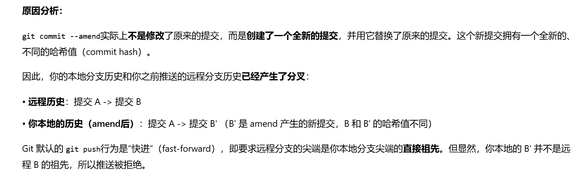
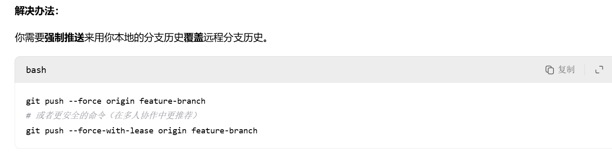

# 问题汇总 & 解决方案

> 我建议，对于git操作以及团队协作有关的问题以及解决方案可以放入到这个项目中，一来可以节省大家的时间，二来为后来人铺路。

> 我先简单写一个我之前遇到的问题

1. 在使用**amend选项**进行补交文件时可能产生的风险：

   1. 问题描述：在amend补交文件之前上传了一次提交到远程，之后发现有些文件忘记交上去了，于是使用amend补交进行补交。事后推送到远程的时候发现出现了交不上去了（因为是很久之前的例子了，没截图，就不放上去了）。这边附上ai给出的解释：

   2. 问题解决：

      只能强制提交了，这样做风险很大，所以大家注意一些，别出现这样的问题了。如果再次出现，可以重新add+commit，不要使用amend。

      > 老登批注：但是你在没有同步到远程仓库的时候随便使用amend

      

2. ……

